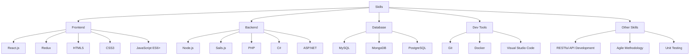

# 👨‍💻 Likhon Sheikh

I am a Full-stack developer skilled in **React**, **Redux**, **Node**, **Sails**, **PHP**, **C#**, **ASP.NET**, **HTML5**, **CSS3**, and **JavaScript**. Passionate about building modern, scalable web applications, and delivering high-quality code that solves real-world problems.

### 🌐 Links
- Website: [likhown.dev](https://likhown.dev)
- Join me on Telegram: [Telegram Community](https://t.me/+IqORCkLQOkU5MDA1)
- Email: [me@likhown.dev](mailto:me@likhown.dev)
- Organization: [GitHub Organization](https://github.com/likhowndev)

---

### 🔧 Technologies I Work With



---

### 📫 Get in Touch
- Feel free to reach out via [me@likhown.dev](mailto:me@likhown.dev) for collaborations, project inquiries, or general tech discussions.
- You can also join my community on [Telegram](https://t.me/+IqORCkLQOkU5MDA1).

---

### 🚀 Current Projects
- Building high-performance, real-time web apps with React, Redux, and Node.js.
- Developing scalable backend systems using Node.js, Sails.js, and PHP.
- Contributing to open-source projects and improving developer tools.

---

### 👥 GitHub Organization
[Check out my GitHub Organization](https://github.com/likhowndev) for a variety of projects, repositories, and contributions in Full-stack development.

---

**Likhon Sheikh**  
*Full-stack Developer*  
**React | Redux | Node | Sails | PHP | C# | ASP.NET | HTML5 | CSS3 | JS**

```
ETH: 0x3A06322e9F1124F6B2de8F343D4FDce4D1009869
```
